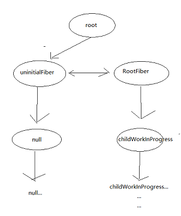
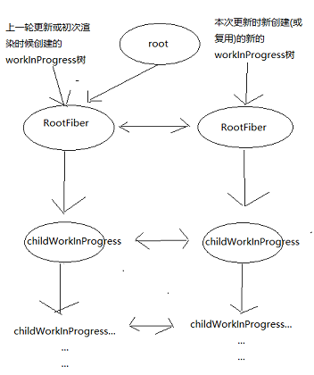

# Simple React

##### 简介 : 简化版的react,  虽然不能真的用在项目里, 但是可以作为React源码的阅读笔记看~
##### 已完成 : fiber架构, setState, 事件代理, ContextAPI, RefAPI

##### 正在进行 : Concurrent异步渲染

 

# React渲染流程
&nbsp;&nbsp;&nbsp;&nbsp;&nbsp;&nbsp;&nbsp;&nbsp;React16对于React15多了一个新的Fiber架构, 每次对比也都是对比的Fiber数据结构。 
&nbsp;&nbsp;&nbsp;&nbsp;&nbsp;&nbsp;&nbsp;&nbsp;当调用ReactDOM.render时，首先React会在内部创建出一个Root对象，Root对象是整个React应用的根儿。每次React开始调度，不管是初次渲染还是setState都是从这个Root根儿上开始的。 
&nbsp;&nbsp;&nbsp;&nbsp;&nbsp;&nbsp;&nbsp;&nbsp;创建好了Root后还会同时创建一个未初始化的Fiber对象，也就是uninitialFiber对象。其实每次React更新都是要对比新旧的Fiber，初次渲染的时候也是要对比新旧Fiber的，但是又因为初次渲染时根本没有上一次的Fiber，所以React才会在一开始就自己创建出一个未初始化也就是啥状态都没有uninitialFiber来假装有上一次的状态，之后才会为本次渲染真正创建一个属于初次渲染的RootFiber，之后用这个RootFiber和刚才那个uninitialFiber作对比。到这儿为止都是React自己干的事儿，和我们用React的人传进来的参数一点关系都没有。 
&nbsp;&nbsp;&nbsp;&nbsp;&nbsp;&nbsp;&nbsp;&nbsp;当Root和uninitialFiber以及RootFiber都创建好了，才会真正开始初次的渲染。 
&nbsp;&nbsp;&nbsp;&nbsp;&nbsp;&nbsp;&nbsp;&nbsp;开始渲染后，会从ReactDOM.render传进去的第一个组件开始循环调度，为根组件下以及根组件等每一个节点不管是原生dom节点，还是函数组件或是类组件甚至React内部提供的组件都创建一个自己对应的fiber对象，在这个过程中所创建的fiber，叫做workInProgress。每个workInProgress都连接着一个保存着当前节点跟新前状态的fiber，这个前一个状态的fiber叫做current。不过由于是初次渲染，所以只有RootFiber有current也就是uninitialFiber，剩下的所有节点的current都是null。  

 

  

&nbsp;&nbsp;&nbsp;&nbsp;&nbsp;&nbsp;&nbsp;&nbsp;这个循环创建(或更新)fiber的过程叫做render阶段，当render阶段结束说明所有的子节点都有了对应的fiber，形成了一颗fiber树，然后就可以进入提交阶段，也就是commit阶段。 
&nbsp;&nbsp;&nbsp;&nbsp;&nbsp;&nbsp;&nbsp;&nbsp;commit阶段会去RootFiber上找产生了更新的fiber，然后一个个地去根据对应的标识去更新。那么RootFiber上的fiber是哪儿来的呢~其实是在render阶段做的。 
&nbsp;&nbsp;&nbsp;&nbsp;&nbsp;&nbsp;&nbsp;&nbsp;因为循环创建workInProgress的过程是一个深度优先的过程，所以会优先给传进来的react元素的一侧创建workInProgress，一侧创建完了再找他的父节点，才去给父节点以及父节点的兄弟节点去创建fiber。而当某一侧的子节点都创建好了之后，会有一个循环来判断刚刚创建好的这个一侧的节点，哪个节点上有更新，对于有更新的节点会被记录到父节点上，这样一层一层地往父节点上记录有更新的子节点，最终就会将全部有更新的节点挂到RootFiber上，形成一条链表。所以在commit阶段就根据这条链表进行对应的增删改的操作。 
&nbsp;&nbsp;&nbsp;&nbsp;&nbsp;&nbsp;&nbsp;&nbsp;这样就完成了初次渲染。之后再执行setState(同步)的话流程基本上差不多，只不过上一轮中创建的RootFiber所领头的那颗workInProgress树则变成了current树，也就是保存着旧状态的fiber树。setState后会重新为本次的更新创建(或复用)新的fiber，也就是新的workInProgress。  

 

  

&nbsp;&nbsp;&nbsp;&nbsp;&nbsp;&nbsp;&nbsp;&nbsp;setState时同样会在render阶段找出哪个节点有更新然后挂到父节点上，最终把全部更新挂到RootFiber上。最后commit阶段挨个儿进行更新。 
&nbsp;&nbsp;&nbsp;&nbsp;&nbsp;&nbsp;&nbsp;&nbsp;以上setState只是在同步状态下。使用了Concurrent组件会开启异步模式，中间render过程会有点不一样。同步状态下render阶段会一把梭，异步模式，就回头再说吧。 
&nbsp;&nbsp;&nbsp;&nbsp;&nbsp;&nbsp;&nbsp;&nbsp;知道了React的整体渲染更新流程，再看那些乱七八糟的函数就好看多了~   

# React函数调用流程
&nbsp;&nbsp;&nbsp;&nbsp;&nbsp;&nbsp;&nbsp;&nbsp;
因为react这个库本身没做啥事儿，就是把JSX肝成React之类的，主要做事儿的都是react-dom做的，所以就只写一些react-dom的方法。 
&nbsp;&nbsp;&nbsp;&nbsp;
ReactDOM.render 
&nbsp;&nbsp;&nbsp;&nbsp;&nbsp;&nbsp;&nbsp;&nbsp;[legacyRenderSubtreeIntoContainer](./procedure/legacyRenderSubtreeIntoContainer)

