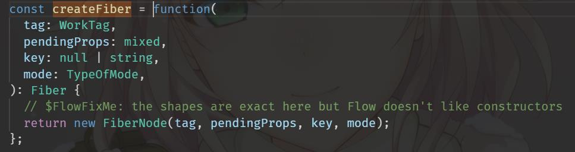

# fiber数据结构

&emsp;&emsp;上一篇简单阐述了一下我自己理解的fiber以及fiber架构，那么这篇来说一说fiber这个数据结构上的具体属性。<br>


<div align="center"> </div>

&emsp;&emsp;图片中是react的源码，在ReactFiber.js文件中可以看到，react是通过一个叫做createFiber的方法去创建一个fiber的。内部主要是通过 new FiberNode 来返回新的fiber。<br>
&emsp;&emsp;接下来我们来看一看FiberNode是怎么创建的fiber节点的。


<br>


ReactFiber.js :

```js
function FiberNode(
  tag: WorkTag,
  pendingProps: mixed,
  key: null | string,
  mode: TypeOfMode,
) {
    this.tag = tag; // 标记不同组件类型 如classComponent表示class类组件 functionComponent表示函数类型组件 还有其他类型的在 ReactWorkTag.js 文件红可以看到 
    this.key = key; // react元素上的key 就是jsx上写的那个key
    this.elementType = null; // 表示fiber的真实类型 比如当前fiber对应的jsx是div 那这个属性就是 'div' 如果这个属性对应一个叫做 Test 的class类 那么这个属性就是 Test 本身
    this.type = null; // 表示fiber的真实类型 这个和elementType大部分情况下是一样的 在使用了懒加载之类的功能时可能会不一样
    this.stateNode = null; // 当前Fiber对应的实例 比如class组件 new完之后就挂在这个属性上
    this.return = null; // 父级Fiber 用来指向当前fiber的父fiber
    this.child = null; // 子级Fiber 指向自己的第一个子Fiber节点 也就是firstChildFiber
    this.sibling = null; // 兄弟节点 指向右边的兄弟节点
    /*
        可能您已经注意到了，fiber上有个属性叫child 但是却没有一个属性叫children
        但是我们的组件中肯定会存在一个父节点下有多个子节点的情况
        那为啥fiber中没有children属性呢~
        其实react中，采用的是“树”还有“链表”这两种数据结构
        这两种数据结构被合在一起使用了
        每个节点 有且仅有一个child属性指向他的firstChild
        每个节点 有且仅有一个sibling属性指向他的右边的兄弟节点
        比如说:
            <div>
                <h1></h1>
                <MyComponent />
                <span>
                    <h2>6666</h2>
                </span>
            </div>
        想上面这个jsx结构 就会形成一颗树和链表的树
        div
         ┃
         ┃ (child)
         ▼
        h1 ————————→ MyComponent ————————→ span  
           (sibling)             (sibling)   ┃
                                             ┃ (child)
                                             ▼
                                             h2
        div.child → h1
        h1.sibling → MyComponent
        MyComponent.sibling → span
        span.child → h2  
    */
    
    
    this.index = 0; // 一般如果没有兄弟节点的话是0 当某个父节点下的子节点是数组类型的时候会给每个子节点一个index index和key要一起做diff
    this.ref = null; // 这个就是react元素上也就是jsx上写的ref
    this.pendingProps = pendingProps; // 新传进来的props
    this.memoizedProps = null; // 上次渲染完后的旧的props
    this.updateQueue = null; // 该fiber上的更新队列 执行一次setState就会忘这个属性上挂一个新的更新 这些更新以链表的形式存在
    this.memoizedState = null; // 旧的state 也表示当前页面上的你能看到的状态 不只是class组件有 function类型组件也可能有
    this.firstContextDependency = null; // 这个没啥b用 跟老版本的context有关 旧版本的context马上就要被废了

    /* 
      这里的mode要用二进制表示 ReactTypeOfMode.js 文件中可以看到
      mode目前有4中 用来表示当前组件下的所有子组件要用处于一种什么状态
      比如concurrentMode就表示当前子节点们要异步进行更新
      strictMode就表示当前子节点们要处于严格模式
     */
    this.mode = mode;
    // Effects
    this.effectTag = NoEffect; // 表示当前fiber要进行何种更新 ReactSideEffectTag.js 文件中可以看到全部更新类型 比如placement表示是新创建的节点 update表示属性可能有变化或者有生命周期之类的
    this.nextEffect = null; // 一条链表 指向下一个有更新的fiber
    this.firstEffect = null; // 子节点中所有有更新的节点中的第一个fiber
    this.lastEffect = null; // 子节点中所有有更新的节点中的最后一个fiber
    /*
        这个effect有必要好好解释一下
        effectTag表示当前这个fiber节点本身有何种更新 没有更新的话就是 NoEffect
        firstEffect是链表
        lastEffect当前fiber的所有子fiber中的最后一个有更新的fiber
        firstEffec这条链表上的fiber从first指向last
        表示的是当前节点的子节点们！注意是子节点不包括自身
        并且是所有有更新的子节点的链表
        也就是说 如果当前fiber下的某个子节点的effectTag是NoEffect的话
        那么这个子节点就不会被包括在这条链表上
        不好理解的话直接看例子!

        <div id="root">                     <div id="root">
            <div class="origin">                <div class="target">
                <h1>123</h1>                        <h1>456</h1>
                <h2>text</h2>    setState           <h2>text</h2>
                <span>          ——————————→         <span class="haschange">
                    <a>888</a>                         <a>888</a>
                    <p></p>                         </span>    
                </span>                             <h3>333</h3>
            </div>                              </div>
        </div>                              </div>


        比如说上面这种情况
        最外层的div的id为root
        它的直接子元素的 div 的 class 从origin变为了target 所以这个 div.origin 的 effectTag 就是Update
        h1的子节点 也就是这个文本从123变成了456 所以h1的effectTag也是Update
        h2没有发生任何改变 所以h2的effectTag是NoEffect
        span的class发生了改变 所以effectTag是Update
        a标签也没改变 effectTag也是NoEffect
        但是p标签被删除了 所以p节点对应的fiber的effectTag是Deletion
        最后还新插如了一个h3标签 由于是新插入的 所以h3的effectTag是Placement

        这样的话 我们来看一看每个节点的fiber的effect链表是个什么样的状态

        首先最外层的 div#root，它的子节点一共有6个，分别是 div.origin、h1、h2、span、a、p(孙子节点也算div#root的子节点)
        其中有更新的是 div.origin、h1、p、span、h3(h3 是新插入的)，一共这五个有更新（包括一个新插入的h3）
        这五个有更新的fiber要本着深度优先的规则 形成链表挂，依次递归把更新往他们自己的父节点身上挂，最终会挂载到最外层的 div#root 的 fiber 上
        
        什么是“深度递归，依次把更新往父节点上挂”呢？
        首先“深度递归”指的是react在处理这些节点对应的fiber的时候，是从子节点开始处理的。
        也就是按照 h1 -> h2 -> a -> p -> span -> h3 -> div.origin -> div#root 的顺序处理。
        至于“依次把更新往父节点上挂”，
        首先react依照深度递归的原则，每处理到一个节点，都先看这个节点的子节点们是否有更新，如果子节点有更新，就把子节点挂到当前fiber上，然后再看当前fiber本身是否有更新，如果有更新，就把当前
        fiber挂到它的父节点身上。举个🌰：
        比如第一个处理的节点是 h1 的fiber，然后会看 h1 的子节点是否有更新，由于 h1 是个叶子节点，没有子元素了(文本类型不算)，所以他也就没有要更新的子节点，下一步看 h1 本身是否有更新，
        会发现 h1 有更新，因为他的文本发生改变，所以会把 h1 对应的fiber挂载到 h1 的父节点 也就是 div.origin 对应 fiber 的 effectList 上，
        此时 div.origin 的 effectList(也就是firstEffect)是：h1的fiber（暂时只有它一个）
        然后处理 h2，h2 和 h1 一样没有子节点，从这个demo来看，h2 自己本身也没有更新，所以 react 不会对 h2 做处理
        第三个处理的是 a 标签（由于深度优先，所以会先处理 a 而不是 span），a 标签和 h2 标签一样没有子节点本身也没有更新，所以react不做任何处理
        第四个处理的，按理说应该是 p 标签，但是 p 标签是一个删除标签，所以处理的流程稍微有点不一样，p 标签是在 react 对数组类型的子节点做diff算法的时候进行处理的，
        这里暂时可以理解成 p 标签的 fiber 已经被挂在到了它的父节点也就是 span 的fiber上了，所以此时的 span 的 effectList 是：p的fiber
        接下来第四个真正处理的就是 span 标签了，这里会发现 span 标签诚如上面说的，已经有一个子节点是 p 标签，要被删除，
        所以会先把这个 p 标签的 fiber 挂到当前节点的父节点的effectList上，也就是 span 的父节点 div.origin 的 effectList 上
        此时 div.origin 的 effectList 是：h1的fiber -> p的fiber
        接下来 span 会看自己本身是否有更新，这个例子中 span 是有更新的，所以把 span 自己的 fiber 挂载到它的父节点上
        此时 div.origin 的 effectList 是：h1的fiber -> p的fiber -> span的fiber
        第五个要处理的是 h3 ，同样第一步先看 h3 是否有要更新的子节点，发现 h3 没有要更新的子节点，于是进行第二步，看 h3 自己是否要进行更新，
        这里的 h3 是一个新插入的节点，所以是有更新的，所以要把 h3 自己挂载到它的父节点，也就是 div.origin 上，
        此时 div.origin 的 effectList 是：h1的fiber -> p的fiber -> span的fiber -> h3的fiber
        第六个要处理的，是 div.origin，还是一样，先看 div.origin 下是否有要更新的子节点，
        发现 div.origin 身上有一串要更新的子节点，也就是h1的fiber -> p的fiber -> span的fiber -> h3的fiber
        所以先把 h1的fiber -> p的fiber -> span的fiber -> h3的fiber 这一串挂载到 div.origin 的父节点也就是 div#root 上
        此时 div#root 的 effectList 是：h1的fiber -> p的fiber -> span的fiber -> h3的fiber
        最后看 div.origin 自己本身是否有更新，发现 div.origin 是一个有更新的节点，于是把自己挂载到它的父节点 div#root 上
        此时 div#root 的 effectList 是：h1的fiber -> p的fiber -> span的fiber -> h3的fiber -> div.origin
        
        之后以此类推，最终会形成一条链表，链表上的每个节点都表示一个要更新的子节点，这条链表最终会挂载到整个 fiber树 的 root 上

        有了这个例子应该就可以明白，任何节点的子节点如果有更新 都会按照深度优先的原则把它的子节点做成链表挂载在它身上
        而如果这个节点自身也有更新，那这个节点会被挂到它的父节点的effect链表上

    */

    this.expirationTime = NoWork; // 当前fiber的优先级 也可以说是过期时间
    this.childExpirationTime = NoWork; // 当前节点的所有子节点中的那个最大的优先级
    /*
        expirationTime 比较复杂 以后慢慢说 同步状态下几乎用不到
        也就是说如果不给组件包裹concurrent组件的话 几乎没太大用
    */

    this.alternate = null; // 指向当前fiber的上一个状态
    /*
        alternate指向当前fiber的上一个fiber
        啥意思呢，就是说
        初次渲染 当前jsx节点会有个fiber 假设名字叫 ding1
        然后setState一次会生成一个新的fiber 假设名字叫ding2
        那么ding1.alternate 就可能指向ding2 然后ding2.alternate就可能指向ding1
        他们是双向的
    */
}

```

&emsp;&emsp;react中通过 new FiberNode 这种方式创建一个新的fiber
react组件中的每一个jsx节点都对应一个fiber
不管是原生dom还是自定义的组件 函数组件 class组件或者说react自己提供的一些组件 都对应一个fiber。<br>
&emsp;&emsp;但是文本类型的节点有点特殊 怎么个特殊法呢？<br>
&emsp;&emsp;&emsp;&emsp;1.当这个文本节点没有其他兄弟节点的情况，也就是说它的父节点只有他一个子节点，这种情况该文本节点不产生fiber，或者说直接让这个文本类型的节点的fiber是null。这是第一种情况<br>
&emsp;&emsp;&emsp;&emsp;2.当这个文本节点有兄弟节点的时候，就是说它的父节点下有很多子节点，这种情况，会为该文本节点创建一个文本类型的fiber。<br>
&emsp;&emsp;&emsp;&emsp;以上对于文本类型的节点情况比较特殊，一定要记住。除此之外的所有节点基本都会被创建自己对应的fiber
<br>
&emsp;&emsp;以上就是fiber这种数据结构的所有属性。
有些属性乍一看肯定不知道是用来干嘛的 没事儿，以后咱慢慢写~<br><br>

&emsp;[下一篇: fiber架构](../fiber3)<br>
