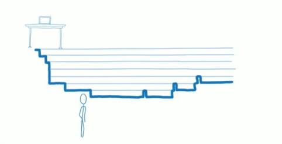
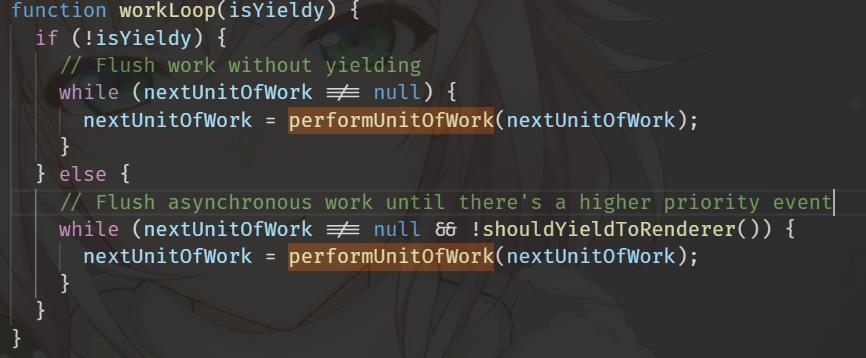
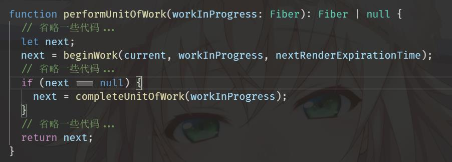
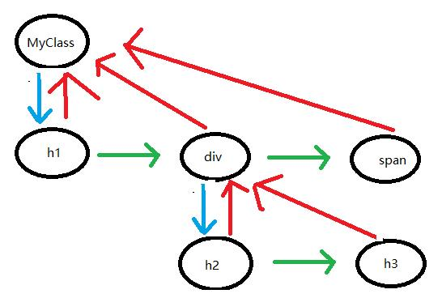

# 创建fiber树的调度算法

&emsp;&emsp;在上一篇介绍fiber的属性时，我们简单提到了一嘴，fiber的创建过程是一个深度优先的过程。
<br>
&emsp;&emsp;在以前我们做深度优先遍历最常见的一种方法是,，使用树形结构，先处理父节点，在对每个子节点进行递归操作以达到深度遍历的目的，这是最常见的方式。<br>
&emsp;&emsp;我们来简单模拟一下~
<br>


首先假设我们有一个如下虚拟dom的结构 :
```js
let vdomTree = {
  id: 1,
  children: [
    { id: 2, children: [
        { id: 3, children: null },
        { id: 4, children: null }
      ]
    },
    {
      id: 5,
      children: [ { id: 6, children: null } ]
    }
  ]
}

```

```js
function beginWork(vdomNode) {
  // 这里对传进来的vdom节点做一些处理
  // 比如创建实例 执行周期 做diff等等
  
  // 最后返回处理后的虚拟dom
  return vdomNode
}
```
然后我们将这棵虚拟dom树作为参数传给一个用来深度遍历的函数中
```js
function deep(parentVdomTree) {
  console.log(id)
  // 对当前这个父节点本身做一些处理
  let vdomAfterTreatment = beginWork(parentVdomTree)
  // 然后获取到当前节点的子节点
  let children = vdomAfterTreatment.children
  if (!children) return
  children.forEach((child) => {
    // 对它的每个子节点进行同样的操作
    // 这样每个子节点以及孙子，曾孙子等等节点都会做一样的处理
    deep(child)
  })
}
deep(vdomTree)
```
<br>
&emsp;&emsp;通过以上方式，我们可以容易的对该dom树中的所有节点都做一些逻辑上的操作，比如生成dom实例，或class实例，执行生命周期，或做diff对比等等。<br>
&emsp;&emsp;如果把上面的tree放到浏览器中跑一跑的话，控制台会依次打印出1, 2, 3, 4, 5, 6<br>
&emsp;&emsp;这也正对应了react16发布时候官方的展示图 :
<div align="center"> </div><br>

&emsp;&emsp;但是这样有一个最大的缺点，那就是一旦我们开始了递归遍历，那么知道该树结构中的所有节点都被遍历完之前，该deep函数的递归是不会停止的，也就是说，deep函数的调用栈会不停的入栈和出栈直到所有的节点都遍历完成。<br>
&emsp;&emsp;这样的话，一旦我们的应用中存在着成千上万的嵌套的节点的话，那这个deep的过程可能就会非常的冗长，就十分有可能造成页面的卡顿，这也是react在16之前一直未解决的问题。<br>
&emsp;&emsp;所以如果要是想解决这个问题，我们必须要设计一种可以随时暂停，退出当前deep调用栈的方法。这种方法，就是react16中新的调度算法。<br>
&emsp;&emsp;接下来我们来看一看react16中新的调度算法长成什么样<br>
在一个叫做ReactFiberScheduler.js的文件中我们可以找到一个叫做workLoop的方法: <br>
<div align="center"> </div><br>
&emsp;&emsp;可以看到该方法中通过while循环来触发了一个叫做performUnitOfWork的方法。这个方法中就会根据fiber的不同类型来做不同的逻辑处理以及生成下一个新的fiber。<br>
&emsp;&emsp;大家可能会注意到该方法根据传进来的isYieldy分成了两个部分，这个isYieldy就表示本次的更新是否允许中断。当没有使用ConcurrentMode的时候或者本次更新已经超时的时候，这个isYieldy是false，也就是不允许中断，这两种情况都会把剩下所有的节点从头到尾一把梭，当节点贼鸡儿多的时候会卡。<br>
&emsp;&emsp;当isYieldy是true的时候，就是允许暂停的时候，会根据shouldYieldToRenderer方法来判断是否要中断当前的更新。这个方法内部会根据本次更新分配到的优先级，也就是咱们上一篇文章里提到的那个expirationTime以及现在react运行的时间还有浏览器每一帧剩余的时间来判断当前的时间片是否还够用。至于具体怎么判断咱回头再聊~大家就先记住，如果使用了异步更新模式的话，每处理完一个fiber节点，都会在这里根据时间判断一下是否要跳出这个loop循环。这就是react16中所谓的"时间分片"。<br>
<br>
&emsp;&emsp;接下来是一个比较关键的函数performUnitOfWork，我们来看一下这个函数<br>

<div align="center"> </div><br>
&emsp;&emsp;可以看到这个函数中传进来一个叫做workInProgress的东西。这个workInProgress其实就是本次要被调度的fiber，就相当于咱们上面写的那个vdomTree，只不过咱们上面传的是假的vdom，这里传进来的是react中的fiber。<br>
&emsp;&emsp;这个fiber传递进来之后被传进了一个叫做beginWork的函数，这个函数内部就是要对这个fiber进行一些处理，比如函数类型的fiber要被执行一下，class类型的fiber要被new一下之类的等等操作，最后返回一个next，这个next就是当前这个fiber的firstChild的fiber。我们在上一篇介绍fiber的属性的时候提到过，每个节点只有一个child属性指向它的firstChild，这里返回的next就是这个firstChild。然后这个next会被返回到workLoop函数中，workLoop中判断时间片是否还有剩余，有剩余的话用这个next作为下一轮的workInProgress再继续进行调度，没有剩余的话就直接跳出循环将线程交还给浏览器的ui线程。<br>
&emsp;&emsp;到了这里应该可以理解，每次会被使用到的fiber，都是在上一轮的beginWork中，根据它的父节点创建的。那么您可能会问，最初一开始传进来的那个fiber是哪儿来的，这个不着急，咱们下一篇再说~<br>
&emsp;&emsp;这里还有一个重点，我们总说react是深度优先，可是我们并没有看到类似forEach循环之类的，并且每次我们返回的next，都是firstChild，也就是一个单独的fiebr节点，并没有把所有的子节点都返回，那么react到底是怎么深度的呢？答案在completeUnitOfWork这个函数中。<br>
&emsp;&emsp;首先在看这个函数之前，我们回顾一下上一篇介绍fiber的属性，每个fiber都有个child属性指向它的firstChild，还有一个属性叫sibling指向它的兄弟节点。这个workLoop中，当判断到next，也就是当前这个节点的firstChild === null的也就是当前节点再没有子节点的时候就会进入completeUnitOfWork，然后completeUnitOfWork还会返回一个next。那这个时候问题就来了，beginWork和completeUnitOfWork返回的next你猜到底是不是一个东西呢？<br>
&emsp;&emsp;答案: 是!!!<br><br><br>
&emsp;&emsp;那就见鬼了!!!<br>
&emsp;&emsp;肯定不是啦~如果俩真是一个东西的话，beginWork返回null，说明当前节点没有子节点，但是如果它有兄弟节点或者兄弟节点有子节点呢？<br>
&emsp;&emsp;我们来举个栗子。假设有如下一个jsx结构 :<br>
<div align="center"> </div><br>
&emsp;&emsp;其中蓝色线代表child，绿色线代表sibling，红色线代表return。这个就是react中最后会真实生成的fiber树的结构。以一种 (树＋链) 表的方式被创建出来。<br>
&emsp;&emsp;1. 现在我们把MyClass的fiber传给performUnitOfWork，MyClass的fiber进入beginWork，beginWork发现MyClass下有三个子节点，于是会循环这个三个子节点，对三个子节点分别创建对应的fiber，但是！最后只返回firstChild，也就是这个h1的fiber，这个h1的fiber会作为next，返回到workLoop，之后workLoop的while循环会用h1的fiber作为新的workInProgress进行performUnitOfWork。<br>
&emsp;&emsp;2. h1进入performUnitOfWork后会进入beginWork，beginWork会返回next，next就是h1的firstChild。但是这个时候注意看，h1下没有任何的东西，也就是说，h1的next是null。这个时候咱们看上线的performUnitOfWork的源码，发现如果next是null的话就会进入completeUnitOfWork这个函数中。<br>
&emsp;&emsp;我们来看一下这个completeUnitOfWork函数:<br>

<div align="center"> </div><br>

&emsp;&emsp;函数中省略了一些代码，咱们主要看react是怎么遍历的就好~<br>
&emsp;&emsp;首先可以看到把当前的这个workInProgress传递进来也就是这个fiber，注意！传进来的不是next，是next的爹。在咱们上面这个例子中，传进来的就是这个h1的fiber。<br>
&emsp;&emsp;3. 之后会进入一个while循环，循环先获取到它的return以及sibling。return在上一篇文章中提到它表示当前节点的父节点，sibling表示当前节点的兄弟节点。在咱们的例子是就是h1的父节点和兄弟节点，分别是MyClass和div的fiber。<br>
&emsp;&emsp;下面省略了一堆逻辑代码之后，会走到一些判断，这些判断和外层这个while循环就是一个深度遍历的过程。<br>
&emsp;&emsp;4. 首先是先判断了sibling(div的fiber)，也就是看当前节点是否有兄弟节点，如果有兄弟节点的话，直接就把兄弟节点作为next返回到performUnitOfWork中，然后再把这个next返回给workLoop进行下一轮的循环。此时返回的是div的fiber。<br>
&emsp;&emsp;5. 接下来div的fiber进入workLoop后会重新进入performUnitOfWork。然后再进入beginWork，之后beginWork中发现div有俩子节点，一个h2一个h3，于是循环这俩节点，分别创建出h2和h3对应的fiber，之后h2作为firstChild被返回给next，本次next不为null，所以直接被返回到workLoop中，之后h2的fiber作为下一轮的workInProgress进入performUnitOfWork和beginWork。<br>
&emsp;&emsp;6. 此时h2下没有子节点，于是beginWork返回null，next是null会进入completeUnitOfWork，此时completeUnitOfWork中的参数是h2的fiber。<br>
&emsp;&emsp;7. 同样，找到h2的fiber的兄弟节点和父节点，例子中分别是h3的fiber的div的fiber。然后先判断是否有兄弟节点，发现有是h3的fiber，把h3的fiber作为next返回。之后h3的fiber会走一样的逻辑重新进入performUnitOfWork和beginWork<br>
&emsp;&emsp;8. beginWork返回h3的next，发现h3下没有child，是个null，于是进入completeUnitOfWork。<br>
&emsp;&emsp;9. 同样找到h3的兄弟节点和父节点。发现h3的兄弟节点是个null，父节点是div的fiber。往下走到判断，第一步看兄弟节点，发现是null，往下走，发现returnFiber不为null，是div，于是让当前的这个workInProgress变成div的fiber，continue这个while循环。<br>
&emsp;&emsp;10. 相当于重新进入到completeUnitOfWork这个函数，但是此时的workInProgress已经变成了div的fiber了。同样的，先找到div的兄弟节点和父节点，本例中分别是span和MyClass。<br>
&emsp;&emsp;11. 往下走，发现有兄弟节点，于是让兄弟节点作为next被返回，此时的next是span的fiber。<br>
&emsp;&emsp;12. span的fiber重新进入perfo和beginWork，beginWork返回next，但是span没有子节点是个null，于是span的fiber进入completeUnitOfWork。<br>
&emsp;&emsp;13. completeUnitOfWork中获取到span 的兄弟节点和父节点，分别是 null 和 MyClass。之后往下走到判断，发现span没有兄弟节点，于是用父节点也就是MyClass作为workInProgress，continue这个while。<br>
&emsp;&emsp;14. 此时的workInProgress是MyClass的fiber，找到他的父节点和兄弟节点，发现他的父节点和兄弟节点都是null(其实MyClass的父节点应该是一个叫RootFiber的东西，这个RootFiber咱们下一篇说，这里先暂时理解成null)，于是最终这个completeUnitOfWork函数返回了 null 作为next。<br>
&emsp;&emsp;15. 到此为止，终于，next已经决计为null了，于是null被返回到workLoop中，workLoop发现nextUnitOfWork是null，于是跳出loop循环，react结束创建fiber的过程。<br><br>
&emsp;&emsp;咱们通过一个例子讲解了react创建fiber树的过程，这个过程总结一下就是从根儿开始往下遍历，一旦某个节点的child是null了，就去遍历这个节点的兄弟节点，一旦这个节点的兄弟节点也是null了，就去遍历他父节点的兄弟节点。然后要处理下一个fiber之前，给了react一个机会，一个可以中断渲染fiber，可以将线程交还给浏览器的机会。此时被中断的fiber会记录在那个nextUnitOfWork全局变量上，这样当下一次再回来继续的时候可以很轻松的找到上一次被打断的地方。<br>
&emsp;&emsp;这个过程还是有点绕的，建议大家打打断点，自己画画图啥的。如果大家不想在源码里打断点的话，我准备了一个简化版的demo&emsp;[点这里](../demo)<br>
&emsp;&emsp;react中很多的地方都用到了这种类似的算法，可以说这个算法和fiber数据结构是完全相辅相成的。这就是react中最主要的fiber架构。<br>


&emsp;[下一篇: react渲染概括](../render&commit)<br>
