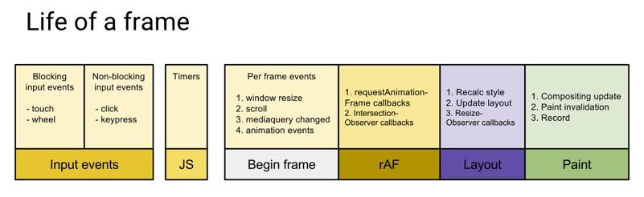
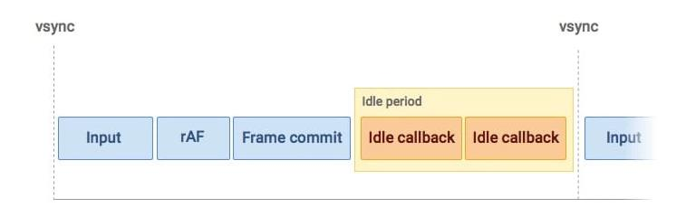

# 时间分片

&emsp;&emsp;早在react16发布之前，就有个新鲜玩意儿被炒的沸沸扬扬，对，就是时间分片这个东西。但是这个挺起来高大上的玩意儿到底是个啥呢？接下来我们就分析一下~ 
&emsp;&emsp;在分析时间分片之前，我们要先抛出三个问题:  
&emsp;&emsp;&emsp;&emsp;&emsp;&emsp;&emsp;&emsp;
&emsp;&emsp;&emsp;&emsp;&emsp;&emsp;&emsp;&emsp;
&emsp;&emsp;&emsp;&emsp;&emsp;&emsp;1. 为什么需要时间分片？ 
&emsp;&emsp;&emsp;&emsp;&emsp;&emsp;&emsp;&emsp;
&emsp;&emsp;&emsp;&emsp;&emsp;&emsp;&emsp;&emsp;
&emsp;&emsp;&emsp;&emsp;&emsp;&emsp;2. 时间分片是怎么实现的？ 
&emsp;&emsp;&emsp;&emsp;&emsp;&emsp;&emsp;&emsp;
&emsp;&emsp;&emsp;&emsp;&emsp;&emsp;&emsp;&emsp;
&emsp;&emsp;&emsp;&emsp;&emsp;&emsp;3. 所谓的时间分片它"分"的到底是啥？ 
&emsp;&emsp; 接下来我们就可以带着以上这三个问题一起去研究研究时间分片这个妮子了~  
### 1. 为什么需要时间分片？
&emsp;&emsp;~~答: 因为牛逼！~~ 
&emsp;&emsp;其实每个新功能的诞生，都一定是为了解决某种可能会存在问题的应用场景的，否则就是个憨逼。所以时间分片也必然是为了处理react15中所存在的某种问题的。大家可以自己试验一下，使用react15去渲染1个动画 + 1万个节点，然后去更新这10万个节点，看看你的浏览器能不能顶得住，我这里准备了个demo，大家可以放进浏览器跑一跑~[react15 demo](./index.html) 
&emsp;&emsp;大家可以发现，一旦当节点多了的时候，程序会变的比较卡顿，这样是react15之前一直被人病诟的原因。于是这个时候，time split闪亮登场！ 
&emsp;&emsp;那么问题来了，当页面中节点多了，使用时间分片就可以阻止卡顿吗？ 
&emsp;&emsp;答案其实否定的。使用时间分片并不能阻止页面产生卡顿，与其说是阻止卡顿，更确切地说法其实是: “减轻程序中，优先级较高的事物(比如css动画)的卡顿时间”。这句话可能目前不太好理解，等咱们往下分析，一会就明了了，大家就先记住，时间分片的作用简单来讲就是上面这句话~  
### 2. 时间分片是怎么实现的？
&emsp;&emsp;在说时间分片之前，我们需要来了解一下浏览器中的“帧”的概念。 
&emsp;&emsp;首先“帧”是什么呢？我们在浏览网页滑动滑轮页面会往下出溜对吧，或者css3出来之后经常能在网站中看到一些很炫酷的动画哈，其实我们所看到的页面，从始至终都是静态的，但是之所以能看到页面很流畅的往下滑或者感到动画运行的很流畅的根本原因，其实是浏览器在不停地刷新页面，浏览器通过很高的频率去刷新页面让页面不停地变化，这才使我们能感到页面的运行是流畅的。经验表明，当1秒钟页面刷新33次左右能够使我们看到比较流畅的动画，也就是需要每隔 大约(1000ms / 33)33ms刷新一次页面。所以有时我们使用setInterval写动画，第二个参数如果大于33ms可能会感觉到不太流畅。很早以前大家听说过的flash动画，如果我没记错好像是一秒20帧吧，所以flash的体验并不是特别好，现在也就被逐渐淘汰了。 
&emsp;&emsp;我们现在知道了浏览器会不停地刷新页面(谷歌控制台里可以唤出显示刷新频率的小窗口)，并且一般情况下每隔33ms刷新一下可以保证流畅(并不绝对是33ms，像谷歌有时候可能是16ms刷新一次，vr好像是1秒刷新90次，3d好像是120次，***我们在这篇文章的后面都假设浏览器的刷新频率是 33ms***)，在这33ms内的页面其实是静态不动的。 
&emsp;&emsp;那每一帧当中浏览器都干了什么事情呢？我们来看下面一张图:
 
&emsp;&emsp;简单总结一下上面的图，其实浏览器的每一帧都可以归纳为四个部分:  
&emsp;&emsp;&emsp;&emsp;执行js + 执行requestAnimation + 浏览器计算dom位置并重新刷新页面 + 第四部分 
&emsp;&emsp;上图中对于这“这第四部分”并没有表示出来。其实还有另外一张图: 
 
&emsp;&emsp;上图中黄色的部分其实就是所谓的“第四部分”。大家可以看到，这个部分执行了一个叫做idleCallback的东西，这是个啥呢？其实它也是浏览器原生提供的一个函数，它的全名叫做requestIdleCallback，和requestAnimationFrame很类似，是一个跟“帧”相关的回调函数。从第一张图可以看出requestAnimationFrame是执行在页面重新渲染之前的，而从第二张图片能发现，这个requestIdleCallback是执行在frame commit之后，在整个帧的最后，当我们的业务代码的js，requestAnimationFrame，以及页面都重新渲染完了后，它才会执行。Idle的中文其实就是“闲散”的意思。换句话说，requestIdleCallback执行在每一帧(假设33ms)剩余的空闲时间中。 
&emsp;&emsp;啥意思呢，举个🌰，假设我们的业务中的同步js代码执行了10ms，然后requestAnimationFrame中又修改了某个dom的位置，这部分的代码又执行了5ms，之后进入到layout步骤，浏览器底层开始重新计算dom们的位置，计算完了重新刷新了一边页面花费了5ms，最终: 
&emsp;&emsp;10ms + 5ms + 5ms = 20ms 
&emsp;&emsp;而向我们刚刚所说的，每一帧是33ms，那么 33ms - 20ms = 13ms，这剩下的13ms干啥呢？没错！就干requestIdleCallback这个函数！这个函数中的所有代码都会放到这一帧所剩下的时间中去执行！ 
&emsp;&emsp;我们可以想一想，把代码放在这一帧剩余的时间中有什么好处呢？ 
&emsp;&emsp;我们刚刚已经说过了，这个函数是执行在页面重新渲染之后，也就是说，这个时间段执行的任何代码，不会影响到我们视觉上的感知！ 
&emsp;&emsp;再举个🌰： 
&emsp;&emsp;&emsp;&emsp;1. 我有个div，每次往右移动 1px，最终一共要到达3px的位置 
&emsp;&emsp;&emsp;&emsp;2. 在requestAnimationFrame中每次让该div的 left 加 1px 
&emsp;&emsp;&emsp;&emsp;3. 第一帧的时候在 33ms 之内，第一步执行了js代码，第二步执行了requestAnimation，第三步刷新了页面，此时的 该div位置是 1px 
&emsp;&emsp;&emsp;&emsp;4. 第二帧的时候在 33ms 之内，第一步执行了js代码，第二步执行了requestAnimation，第三步刷新了页面，此时的 该div位置是 2px 
&emsp;&emsp;&emsp;&emsp;5. 第三帧的时候在 33ms 之内，第一步执行了js代码，第二步执行了requestAnimation，第三步刷新了页面，此时的 该div位置是 3px，达到了目的地 
&emsp;&emsp;&emsp;&emsp;6. 大家要注意的是，由于每次重新渲染页面，都发生在33ms之内，所以对于我们的肉眼来讲，第2步到第4步的div位移过程是一个连续运动的过程！ 
&emsp;&emsp;&emsp;&emsp;7. 所以，如果这三帧，每一帧在刷新完页面之后还剩余一些时间的话，我们在这部分时间中执行的代码，是完全不影响我们视觉上的流畅的！ 
&emsp;&emsp;这个时候大家也许就能想到一个很牛逼的事情: “如果我们把项目中的所有复杂的计算过程都放到这种一帧中剩余的时间中，那不就完全不影响其他动画或者交互了嘛！” 
&emsp;&emsp;没错！理论上讲确实是这样的~react16中，也正是应用这种方法，来做到尽量减少对动画等优先级较高的操作的卡顿的。那么react16中是怎么做的呢？ 
&emsp;&emsp;react16中，如果开启了异步渲染模式(时间分片模式)的话，就会把所有的复杂的操作放到每一帧的空闲时间中，从而达到不影响优先级较高的操作的目的。复杂的操作比如“diff算法”，“初始化函数或class组件”，“执行组件生命周期”，“创建或更新fiber树”等都算是复杂的操作。通过将这种复杂的同步算法，放到了不影响视觉流畅的空闲时间当中，这就是react16中的时间分片的假面！ 
&emsp;&emsp;到此为止咱们讨论了最开始提出的前俩个问题：为什么要时间分片以及时间分片实现原理，但是为啥说是时间分片的“假面”呢？还有咱们开始提出的第三个问题：时间分片分的到底是啥呢，我们下一回再讨论~

&emsp;[下一篇: 时间分片分的到底是啥？](../time-split2) 
